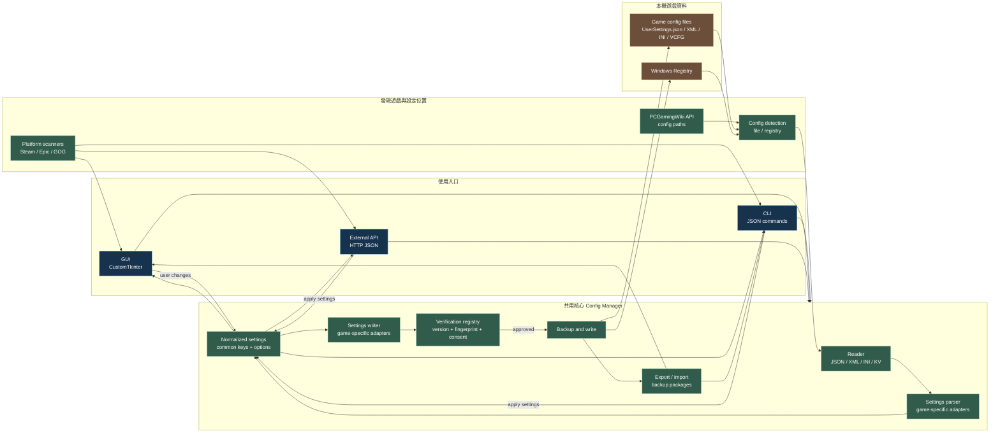

# Game Setting Aligner

> 一款用於擷取、比較與覆蓋遊戲設定的工具  
> A tool to capture, compare, and override game settings


---

## 功能特色 / Features

- 🎮 **多平台支援 / Multi-platform Support**  
  支援 Steam、Epic Games 及 GOG 三大遊戲平台的設定掃描與管理  
  Supports scanning and managing settings for Steam, Epic Games, and GOG

- 🔍 **設定擷取與比較 / Capture & Compare**  
  自動擷取遊戲設定檔，並與建議設定進行比較  
  Automatically captures game config files and compares them with recommended settings

- ✏️ **設定覆蓋與寫入 / Override & Write**  
  可將推薦設定直接覆蓋至遊戲設定檔  
  Allows overriding game config files with recommended settings

- 📤 **設定匯出 / Config Export**  
  支援將目前遊戲設定匯出以供備份或分享  
  Supports exporting current game settings for backup or sharing

- 🌐 **Wiki API 整合 / Wiki API Integration**  
  透過 PCGamingWiki API 自動查詢遊戲建議設定  
  Queries recommended settings via the PCGamingWiki API

- 🖥️ **圖形化介面 / GUI Interface**  
  基於 CustomTkinter 的現代化 GUI，操作直覺友善  
  Modern and intuitive GUI built with CustomTkinter

---

## 架構總覽 / Architecture Overview

這張圖可以用來在約 3 分鐘內說明 Game Tuner 的完整機制：



### 3 分鐘說法 / Three-minute explanation

1. **先從入口開始**：使用者可以從 GUI、CLI 或 HTTP API 操作，但三者最後都進入同一套 `config_manager`，因此不會各自維護一套設定邏輯。
2. **再說讀取流程**：工具先透過 Steam、Epic、GOG 掃描已安裝遊戲，並用 PCGamingWiki 找出該遊戲的設定路徑；接著偵測檔案或 Registry，讀取 JSON、XML、INI、VCFG 等格式。
3. **強調正規化**：每款遊戲的原始格式不同，但 parser 會把它們轉成共同的設定模型，例如解析度、VSync、幀率上限與 upscaling，讓 GUI、CLI 和 API 都能用同一種資料表示。
4. **說明安全寫入**：使用者修改共同模型後，writer 再把設定轉回該遊戲專用格式。真正寫入前會檢查遊戲版本、設定結構 fingerprint、verification rule 與使用者同意；通過後先備份，再寫回原始檔案。
5. **最後收斂成閉環**：寫入結果可以重新讀取驗證，也可以匯出成 JSON 備份或診斷資料。簡單說，這是一個「多入口、單一核心、遊戲專用 adapter、受控寫入」的設定管理工具。

### 一句話版本 / One-liner

> Game Tuner 把不同平台、不同遊戲、不同設定格式，轉成同一套可讀、可比較、可安全寫回的設定模型。

### English version

Use the standalone [HTML architecture diagram](docs/game-tuner-architecture.html) when you need a visual explanation that can be opened directly in a browser.

1. **Start with the entry points:** Users can work through the GUI, CLI, or HTTP API. All three routes call the same `config_manager`, so the product has one source of truth for settings behavior.
2. **Explain discovery and reading:** Platform scanners find installed games, while PCGamingWiki provides the known configuration paths. The tool then detects files or Registry entries and reads formats such as JSON, XML, INI, and VCFG.
3. **Emphasize normalization:** Every game stores settings differently. Game-specific parsers convert those formats into one normalized settings model containing common fields such as resolution, VSync, frame limit, and upscaling.
4. **Explain guarded writes:** When a user changes a setting, a game-specific writer converts the normalized model back to the original format. Before anything is written, the tool checks the game version, configuration fingerprint, verification rules, and user consent. It creates a backup before applying an approved write.
5. **Close the loop:** The result can be read back for verification, exported as a JSON backup, or packaged as diagnostic data. In one sentence: Game Tuner is a multi-entry, single-core configuration manager with game-specific adapters and controlled writes.

> Game Tuner turns platform-specific, game-specific configuration formats into one model that can be read, compared, and safely written back.

---

## 系統需求 / Requirements

- **Python:** 3.8 以上 / 3.8 or above
- **作業系統 / OS:** Windows（建議）/ Linux / macOS

### 依賴套件 / Dependencies

| 套件 / Package   | 版本 / Version |
|-----------------|---------------|
| requests        | >= 2.31.0     |
| vdf             | >= 3.4        |
| beautifulsoup4  | >= 4.12.0     |
| customtkinter   | >= 5.2.0      |
| lxml            | >= 4.9.0      |

---

## 安裝方式 / Installation

1. **複製專案 / Clone the repository**

   ```bash
  git clone https://github.com/ElyZeng/Game-Setting-Aligner-Agent.git
  cd Game-Setting-Aligner-Agent
   ```

2. **安裝依賴 / Install dependencies**

   ```bash
   pip install -r requirements.txt
   ```

---

## 使用方式 / Usage

### GUI 模式 / GUI Mode

啟動圖形化介面 / Launch the GUI:

```bash
python main.py
```

### CLI 模式 / CLI Mode

無需 GUI 環境，適合自動化與 AI Agent 整合 / No GUI required, suitable for automation and AI agent integration:

```bash
# 掃描已安裝遊戲 / Scan installed games
python cli.py scan
python cli.py scan --platform steam

# 查詢 PCGamingWiki 設定檔路徑 / Query config paths from PCGamingWiki
python cli.py query "Cyberpunk 2077"

# 偵測本地設定檔 / Detect local config files
python cli.py detect "Cyberpunk 2077"

# 解析圖形設定 / Parse graphics settings
python cli.py parse "Cyberpunk 2077"

# 修改設定 / Apply settings
python cli.py apply "Cyberpunk 2077" --settings '{"vsync": "Off", "frame_limit": "120"}'

# 匯出設定備份 / Export config backup
python cli.py export --output backup.json
python cli.py export --games "Cyberpunk 2077,Counter-Strike 2" --output backup.json

# 匯入設定還原 / Import config restore
python cli.py import backup.json
```

所有 CLI 指令輸出為 JSON 格式 / All CLI commands output JSON format.

### 驗證名單與診斷資料 / Verification Rules and Diagnostics

遊戲只有在 GitHub Release 驗證名單中標為 `write_candidate`（受控測試）或 `write_verified`（正式支援）時才能寫入設定。
未知、版本不符或設定格式不符的遊戲維持唯讀，可建立匿名診斷資料包。

```bash
# 查看遊戲是否可讀取或可安全寫入
python cli.py verification-status "Counter-Strike 2"

# 下載並驗證最新 GitHub Release 名單
python cli.py update-verification

# 從核准可信管道匯入離線規則包
python cli.py import-rules verified-rules.gtrules

# 明確允許安裝較舊版本
python cli.py import-rules verified-rules.gtrules --allow-rollback

# 匯出已選遊戲的匿名診斷 ZIP；設定內容預設不會包含
python cli.py diagnostic-export --games "Counter-Strike 2,Street Fighter 6"
python cli.py diagnostic-export --games "Counter-Strike 2" --include-content
```

`update-verification` 失敗時，`error` 欄位會標示失敗原因，詳細偵錯記錄（連線狀態、Release 資產清單、雜湊比對結果）會寫入 `%LOCALAPPDATA%\GameTuner\logs\verification.log`，回報問題時請附上這份記錄。

離線 `.gtrules` 資料包會驗證 SHA-256、manifest schema、格式版本及最低 client version，安裝時保留上一份有效規則。SHA-256 只能證明資料完整性，**不能驗證發布者身分**；manifest 與 checksum 若同時被替換，雜湊仍可能吻合。因此只應匯入透過核准可信管道取得的資料包。較舊版本預設拒絕，只有人工確認後才使用 `--allow-rollback`。

GUI 的 **Export Diagnostics** 會先開啟逐檔選取視窗。`input`、`key`、`binding`、`save`、`log`、`cache` 與空檔會預設排除；使用者仍可手動調整、全選、全不選或恢復推薦選取。若要包含匿名化設定內容，建立 ZIP 前會再次確認。

寫入設定同時需要精確匹配的 `write_candidate` / `write_verified` 規則與客戶明確同意測試功能。`write_candidate` 不代表正式支援；完整驗收通過後才升級為 `write_verified`。GUI 中必須按下 **Enable Test Writes** 並確認警告；CLI 則必須在第一次寫入時加入 `--confirm-test-write`：

```bash
python cli.py apply "Counter-Strike 2" --settings '{"vsync": "Off"}' --confirm-test-write
```

GTA V Enhanced 的一般 `cli.py import` 會拒絕匯入；只有在遊戲與啟動器退出、雲端同步暫停、已人工審核精確 `write_candidate` 規則並存放於隔離規則目錄，且獨立 v2 基線套件內容與目前實檔逐位元組相同時，才可驗證零設定變更的還原：

```bash
python cli.py restore-baseline "Grand Theft Auto V Enhanced" "<private-baseline-v2.json>" --expected-sha256 "<previously-verified-sha256>" --rules-dir "<isolated-reviewed-rules-dir>" --confirm-no-change-restore
```

此命令先保存獨立救援備份，匯入後核對前後原始位元組與解析值；不啟用一般測試寫入同意，也不證明從已更改設定還原、逐值 Apply 或遊戲內持久性。

本機驗證名單、備份與匯出摘要保存於 `%LOCALAPPDATA%\GameTuner\`。資料包採隨機 ID 命名，沒有自動上傳功能；僅透過核准的私下管道交付。

維護者收到資料包後，可先建立本機待審核候選項目；人工審核規則後，再產生要上傳到 GitHub Release 的資產：

```bash
python tools/manage_verification.py candidate game-tuner-report-<id>.zip --output candidate.json
python tools/manage_verification.py build-release reviewed-rules.json --output-dir release-assets --version 1.0.0 --minimum-client-version 0.05.1
python tools/manage_verification.py build-bundle reviewed-rules.json --output verified-rules.gtrules --version 1.0.0 --minimum-client-version 0.05.1
```

若只新增單一遊戲規則，請先取得並核對**當下已發布**的 `verified-games.json` 與同目錄的 `verified-games.json.sha256`，再對 `build-release` 或 `build-bundle` 加上 `--base-manifest <verified-games.json>`；建置器會保留基底規則並拒絕校驗錯誤或重複規則。不要用 GTA-only 規則陣列取代原有驗證名單，也不要將本機舊版預覽當成目前遠端版本。

若要更新已發布遊戲的同一平台、版本及指紋規則，可用僅含該筆審核規則的 JSON 清單，搭配 `--base-manifest <verified-games.json> --replace-base-rule` 精確替換一筆。Forza Horizon 6 `quick_preset` 的候選規則要求最低客戶端 `0.08.18`；必須先發佈包含新版 writer 與 preflight 的客戶端，再發布新規則，不能讓舊版 `0.08.17` 取得此寫入權限。

將 `release-assets/verified-games.json` 及 `release-assets/verified-games.json.sha256` 以同一個 Release 上傳至 `ElyZeng/Game-Setting-Aligner-Agent`。

乾淨 Windows 環境的完整測試流程請見 [docs/clean-environment-test.md](docs/clean-environment-test.md)。

要由不熟悉工具的測試人員使用 EXE 與 GUI 驗證單一遊戲是否完整支援掃描、讀取、寫入、備份、還原與診斷輸出，請使用 [docs/full-game-validation.md](docs/full-game-validation.md)。

本輪 19 個驗證目標的分批順序、目前能力與升級 support list 的門檻，請見 [docs/game-validation-plan.md](docs/game-validation-plan.md)。

### 外部 API 介面 / External API Interface

如果你不在 VS Code，也可以直接用 HTTP 呼叫同一套能力。  
If you are outside VS Code, you can call the same capabilities over HTTP.

啟動 API 伺服器 / Start API server:

```bash
python external_api.py --host 127.0.0.1 --port 8787
```

健康檢查 / Health check:

```bash
curl http://127.0.0.1:8787/health
```

掃描遊戲 / Scan games:

```bash
curl http://127.0.0.1:8787/scan
curl "http://127.0.0.1:8787/scan?platform=steam"
```

查詢與解析（POST JSON）/ Query and parse (POST JSON):

```bash
curl -X POST http://127.0.0.1:8787/query ^
  -H "Content-Type: application/json" ^
  -d "{\"game\":\"Cyberpunk 2077\"}"

curl -X POST http://127.0.0.1:8787/parse ^
  -H "Content-Type: application/json" ^
  -d "{\"game\":\"Cyberpunk 2077\"}"
```

可用端點 / Available endpoints:

- `GET /health`
- `GET /scan?platform=steam|epic|gog`
- `POST /query` 需要 `{"game": "...", "install_path": "..."}`
- `POST /detect` 需要 `{"game": "...", "install_path": "..."}`
- `POST /parse` 需要 `{"game": "..."}`，可選 `config_files`
- `POST /apply` 需要 `{"game": "...", "settings": {...}}`
- `POST /export` 可選 `{"games": ["A", "B"], "output": "export.json"}`
- `POST /import` 需要 `{"package": "export.json"}`

### 匿名化客戶設定收集 / Anonymized Customer Collection

收集器只讀取 PCGamingWiki 指定的設定路徑，不會修改遊戲設定。輸出預設會匿名化 Windows 使用者名稱、Steam User ID 與敏感設定內容，建議保存到已被 Git 忽略的 `local_exports/`：

```powershell
python tools/collect_configs.py --game "F1 25" --output "local_exports\f1-25-anonymous.json"
```

需要指定遊戲安裝路徑的遊戲：

```powershell
python tools/collect_configs.py `
  --game "Street Fighter 6" `
  --install-path "D:\SteamLibrary\steamapps\common\Street Fighter 6" `
  --output "local_exports\street-fighter-6-anonymous.json"
```

輸出包含 `parsed_settings`、設定檔格式與收集時間；`local_exports/`、`anonymous_exports/` 與 `customer_exports/` 不會被 Git 追蹤。分享前仍應人工檢查匯出內容。

### VS Code Copilot Skill

在 VS Code 中安裝 GitHub Copilot 後，可直接透過聊天使用此 Skill。  
With GitHub Copilot installed, use this skill directly in VS Code chat.

輸入 `/game-tuner` 或自然語言（如「幫我掃描遊戲」）即可觸發。  
Type `/game-tuner` or use natural language (e.g., "scan my games") to invoke.

---

## 在新機器上測試（無 VS Code 環境）/ Testing on a New Machine (No VS Code)

以下是在一台**有安裝遊戲但沒有 VS Code** 的 Windows 電腦上進行完整測試的步驟：

### 前置準備 / Prerequisites

1. **安裝 Python 3.8+**
   - 下載：https://www.python.org/downloads/
   - 安裝時勾選 **"Add Python to PATH"**
   - 驗證：
     ```bash
     python --version
     ```

2. **取得專案**（擇一）

    方法 A — 從 GitHub Clone：
   ```bash
    git clone https://github.com/ElyZeng/Game-Setting-Aligner-Agent.git
    cd Game-Setting-Aligner-Agent
   ```

   方法 B — 下載 Release 的 `.exe`（免安裝 Python）：
  - 前往 https://github.com/ElyZeng/Game-Setting-Aligner-Agent/releases
   - 下載 `GameTuner.exe`，雙擊即可啟動 GUI

3. **安裝依賴**（僅方法 A 需要）
   ```bash
   pip install -r requirements.txt
   ```

### 測試步驟 / Test Steps

#### 測試 1：掃描遊戲（驗證平台偵測）

```bash
python cli.py scan
```

**預期結果：** 輸出 JSON 陣列，包含該電腦上已安裝的 Steam / Epic / GOG 遊戲。  
**驗證重點：**
- [ ] 遊戲名稱正確
- [ ] `platform` 欄位為 "Steam"、"Epic" 或 "GOG"
- [ ] `install_path` 路徑存在

#### 測試 2：查詢設定檔路徑（驗證 Wiki API）

從測試 1 的結果中挑一個遊戲名稱：

```bash
python cli.py query "<遊戲名稱>"
```

**預期結果：** 輸出包含 `raw_paths` 和 `expanded_paths` 的 JSON。  
**驗證重點：**
- [ ] `expanded_paths` 不為空
- [ ] 路徑指向該電腦上的實際位置

#### 測試 3：偵測本地設定檔（驗證檔案讀取）

```bash
python cli.py detect "<遊戲名稱>"
```

**預期結果：** JSON 陣列，每個項目包含 `expanded_path`、`content`、`found`。  
**驗證重點：**
- [ ] 至少一個項目的 `found` 為 `true`
- [ ] `content` 包含實際設定內容

#### 測試 4：解析圖形設定（驗證設定解析器）

```bash
python cli.py parse "<遊戲名稱>"
```

**預期結果：** JSON 包含 `settings` 物件，內有 7 個設定值。  
**驗證重點：**
- [ ] `resolution` 顯示合理的解析度（如 "1920x1080"）
- [ ] `vsync`、`screen_mode` 等有正確的值或 `null`（表示該遊戲不支援）

#### 測試 5：修改設定（驗證寫入功能）

⚠️ **建議先執行測試 6 匯出備份！**

```bash
python cli.py apply "<遊戲名稱>" --settings "{\"vsync\": \"Off\"}"
```

**預期結果：** JSON 陣列，每個項目 `status` 為 "ok"。  
**驗證重點：**
- [ ] 再次執行 `python cli.py parse "<遊戲名稱>"` 確認 vsync 已變為 "Off"
- [ ] 啟動遊戲確認設定已生效

#### 測試 6：匯出/匯入設定（驗證備份還原）

```bash
# 匯出
python cli.py export --games "<遊戲名稱>" --output test_backup.json

# 確認檔案已建立
dir test_backup.json

# 匯入還原
python cli.py import test_backup.json
```

**驗證重點：**
- [ ] `test_backup.json` 檔案已建立且大小 > 0
- [ ] 匯入後輸出的 `restored` 包含正確的遊戲名稱和路徑

#### 測試 7：GUI 模式（僅方法 A）

```bash
python main.py
```

**驗證重點：**
- [ ] 視窗正常開啟
- [ ] 點擊「Refresh」後顯示遊戲列表
- [ ] 展開遊戲可看到圖形設定

#### 測試 8：EXE 執行（僅方法 B）

雙擊 `GameTuner.exe`

**驗證重點：**
- [ ] 應用程式正常啟動（無 Python 環境也能執行）
- [ ] 功能與測試 7 相同

### 快速煙霧測試腳本 / Quick Smoke Test Script

將以下存為 `smoke_test.bat` 並執行：

```batch
@echo off
echo === Game Tuner Smoke Test ===
echo.
echo [1/4] Version check...
python cli.py --version
echo.
echo [2/4] Scanning games...
python cli.py scan
echo.
echo [3/4] Querying PCGamingWiki (Cyberpunk 2077)...
python cli.py query "Cyberpunk 2077"
echo.
echo [4/4] Export test...
python cli.py export --output smoke_test_export.json
echo.
echo === Smoke test complete ===
pause
```

---

## 專案結構 / Project Structure

```
Game-Setting-Aligner-Agent/
├── main.py                     # GUI 入口點 / GUI entry point
├── cli.py                      # CLI 入口點 / CLI entry point
├── requirements.txt            # 依賴套件清單 / Dependency list
├── LICENSE
├── .gitignore
├── .github/
│   └── skills/
│       └── game-tuner/
│           └── SKILL.md        # VS Code Copilot Skill 定義
├── config_manager/             # 設定檔管理模組 / Config file management
│   ├── __init__.py
│   ├── config_exporter.py      # 設定檔匯出 / Config export
│   ├── package.py              # 套件工具 / Package utilities
│   ├── reader.py               # 設定檔讀取 / Config reader
│   ├── settings_parser.py      # 設定解析器 / Settings parser
│   ├── settings_writer.py      # 設定寫入器 / Settings writer
│   └── writer.py               # 設定檔寫入 / Config writer
├── scanner/                    # 平台掃描模組 / Platform scanner
│   ├── __init__.py
│   ├── steam.py                # Steam 遊戲掃描 / Steam game scanner
│   ├── epic.py                 # Epic Games 掃描 / Epic Games scanner
│   └── gog.py                  # GOG 掃描 / GOG scanner
├── gui/                        # 圖形化介面 / Graphical user interface
│   ├── __init__.py
│   └── app.py                  # CustomTkinter GUI 主程式 / Main GUI app
├── wiki_api/                   # Wiki API 整合 / Wiki API integration
│   ├── __init__.py
│   └── pcgamingwiki.py         # PCGamingWiki API 查詢 / PCGamingWiki queries
├── tools/                      # 診斷工具 / Diagnostic tools
└── tests/                      # 測試目錄 / Test directory
```

---

## 授權 / License

本專案採用 [MIT License](LICENSE) 授權。  
This project is licensed under the [MIT License](LICENSE).

Copyright (c) 2026 Ely
